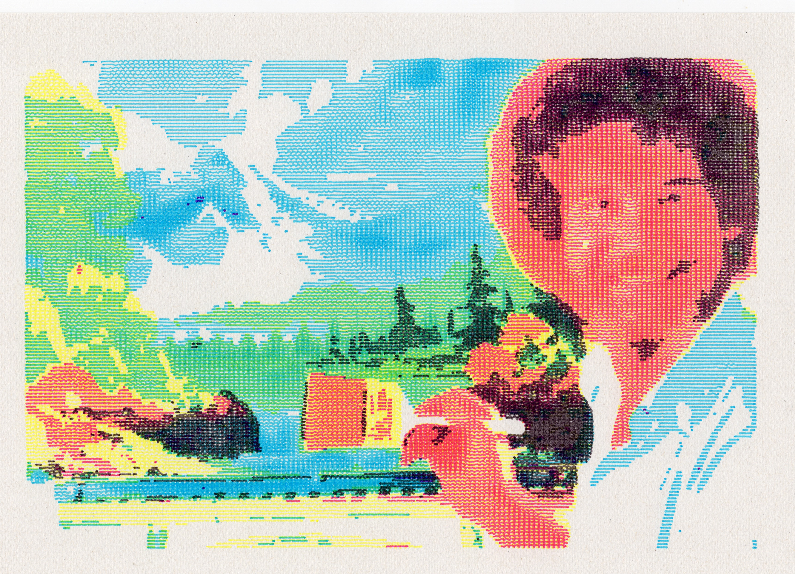
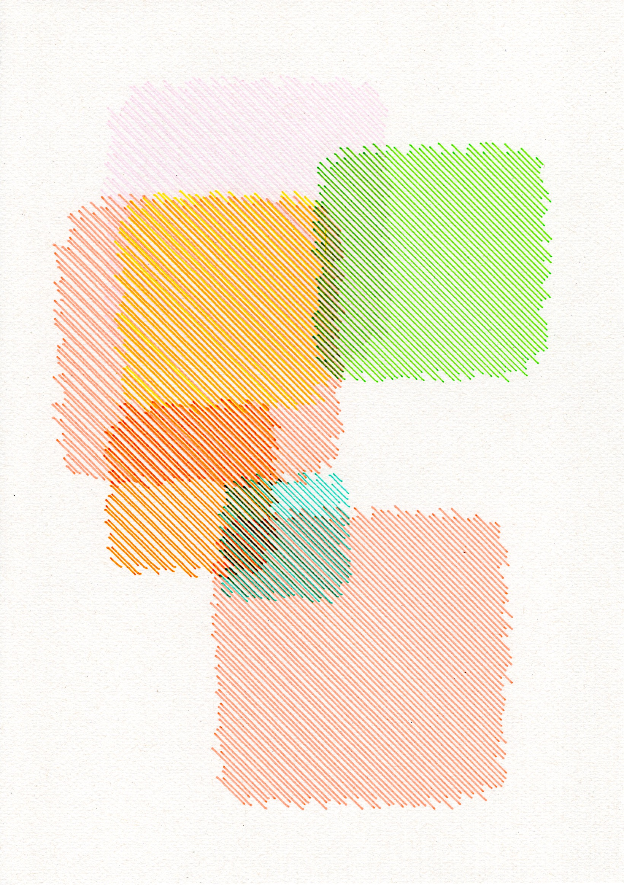
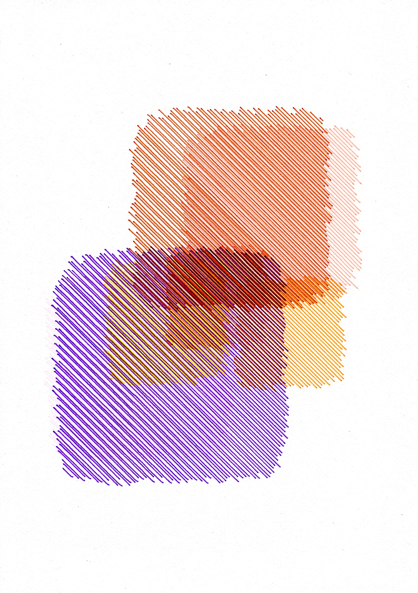
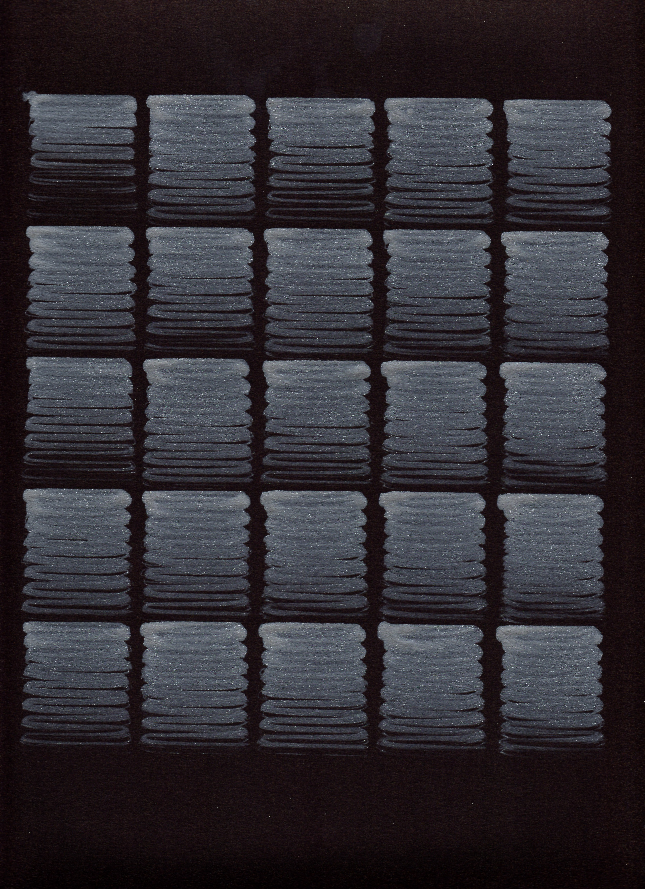
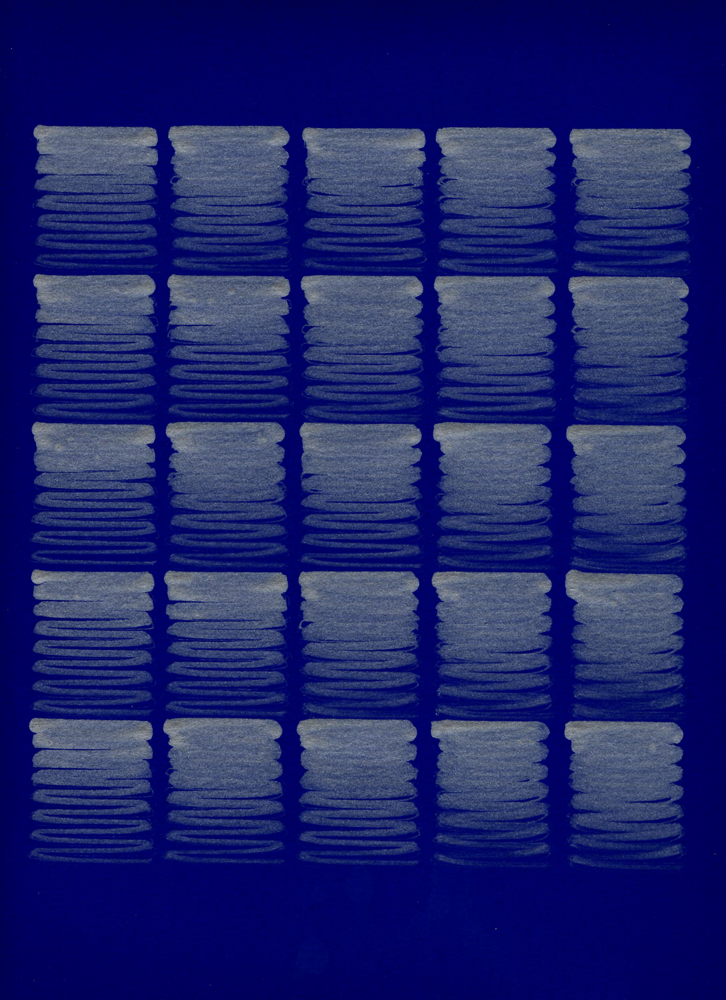
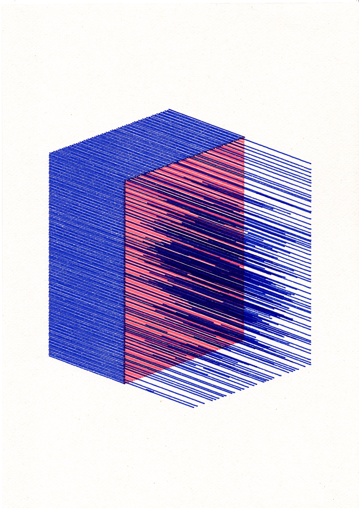
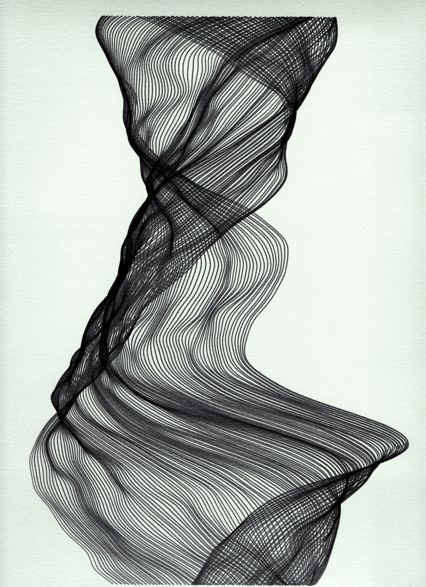
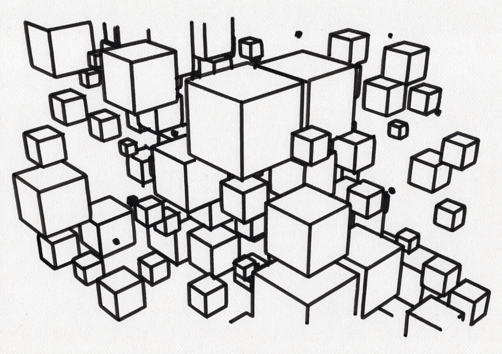

# Pen Plotter



_The Joy of Plotting — a four-colour scanline portrait generated with
[`linetone`](sketches/linetone/)._

A generative pen-plotting laboratory exploring how algorithms, geometry, ink,
and physical constraints interact. Python sketches and Blender line art are
turned into optimized SVG paths and machine-ready G-code for a LY DrawBot.

The repository is both a collection of visual experiments and the reproducible
toolchain used to take them from code to paper.

## Selected work

### Abstract aquarelles

Overlapping fields of parallel colour lines, where transparent layers create
new tones directly on paper. Generated with
[`abstract_aquarelle`](sketches/abstract_aquarelle/).




### Fading squares

A study of ink depletion: every cell starts freshly loaded, then records the
gradual loss of pigment along one continuous serpentine path. Generated with
[`erode`](sketches/erode/).




### Isometric fog

Two superimposed line fields turn a simple volume into a translucent,
fog-filled structure. Generated with
[`isometric-3d`](sketches/isometric-3d/).



### Ribbon

A continuous family of curves folds into a soft, shifting volume; density and
overlap provide the shading. Generated with [`ribbon`](sketches/ribbon/).



### Blender squares

An isometric field of cubes produced through the repository's
[Blender-to-plotter workflow](#blender-workflow).



## Pipeline

```text
vsketch / Blender
        │
        ▼
       SVG
        │
        ▼
vpype: layout, merge, simplify, sort
        │
        ▼
      G-code
        │
        ▼
Universal Gcode Sender + LY DrawBot
        │
        ▼
   physical drawing
```

The pipeline deliberately keeps drawing generation separate from
machine-specific output. SVG files can be generated, inspected, and modified
without owning a plotter.

## Requirements

- Python 3.11 or later
- [`uv`](https://docs.astral.sh/uv/)
- Make (optional, but used by the documented shortcuts)
- a desktop environment for the interactive vsketch and vpype viewers
- Universal Gcode Sender only when controlling the plotter

The Python environment is locked in `uv.lock`.

## Quick start without a plotter

Clone the repository and install the locked dependencies:

```bash
git clone https://github.com/alex-boulanger/pen-plotter.git
cd pen-plotter
uv sync --locked
```

List the available commands and render a sketch with its default parameters:

```bash
make help
make render erode
```

The SVG is written to `sketches/erode/output/erode.svg`. Open the interactive
viewer when developing a sketch:

```bash
uv run vsk run sketches/erode
```

## Repository commands

Paths passed to the drawing commands are relative to `sketches/` and omit the
`.svg` extension.

```bash
make preview erode/output/erode
make optimize fade/output/fade_liked_1
make length fade/output/fade_liked_1
make gcode fade/output/fade_liked_1
make gcode-layers linetone/output/linetone_liked_1
make gcode-ink-reload erode/output/erode
make test
```

| Command            | Purpose                                           |
| ------------------ | ------------------------------------------------- |
| `render`           | render a vsketch project to SVG                   |
| `preview`          | display an SVG and its plotting statistics        |
| `optimize`         | merge, simplify, reloop, and sort paths           |
| `length`           | report pen-down and pen-up travel                 |
| `gcode`            | generate standard LY DrawBot G-code               |
| `gcode-layers`     | generate one LY DrawBot G-code file per SVG layer |
| `gcode-ink-reload` | reload ink at `(0, 0)` before every path          |
| `test`             | run the automated test suite                      |

`gcode-ink-reload` preserves path creation order. Do not run `optimize` first when
the order of ink reloads is part of the drawing.

## Blender workflow

Blender SVG exports can be previewed, fitted to A4, optimized, and converted to
G-code:

```bash
make blender-preview 0021
make blender-optimize 0021
make blender-gcode 0021
```

The Blender-specific pipeline proportionally fits the geometry to an A4
landscape page with a configurable margin. By default it reads from
`~/Documents/Blender/svg-output` and writes G-code to
`~/Documents/Blender/optimized-gcode`.

## Local configuration

The default paths can be overridden without editing the tracked Makefile:

```bash
cp config.mk.example config.mk
```

Edit `config.mk` for your workstation. The file is ignored by Git. Every value
can also be overridden for a single command:

```bash
make blender-gcode 0021 BLENDER_PAGE_MARGIN=15mm
```

Regular sketch G-code is written by default to
`~/Documents/Pen Plotter/optimized-gcode`.

## Hardware and safety

The profiles in [`calibration/ly_drawbot.toml`](calibration/ly_drawbot.toml)
are specific to the machine used for this project. They control page rotation,
axis flipping, feed rates, the pen servo, and the experimental ink-reload
sequence.

Read the [LY DrawBot setup and safety notes](docs/hardware.md) before sending
G-code to a machine. Always inspect a preview, verify the work origin, and test
at a low feed rate after changing calibration. Generated G-code must not be
assumed safe for another plotter.

### Parking the carriage

With the work origin at the bottom-left of an A4 landscape page, the following
commands raise the pen and park the carriage in the top-left corner:

```gcode
M3 S0
G21
G90
G1 X0 Y240 F3000
M2
```

Then reset to 0 0

```gcode
M3 S0
G21
G90
G1 X0 Y0 F3000
M2
```

## Project structure

```text
.
├── calibration/       # LY DrawBot profiles and calibration drawings
├── docs/              # hardware notes and gallery assets
├── shared/            # reusable geometry and image utilities
├── sketches/          # original generative-art projects
├── tests/             # deterministic geometry and rendering tests
├── config.mk.example  # local path configuration template
├── Makefile           # rendering, inspection, optimization, and G-code tasks
├── pyproject.toml      # Python project metadata and dependencies
└── uv.lock             # reproducible dependency lock
```

Create a new vsketch project with:

```bash
uv run vsk init sketches/my-sketch
```

## Tests

Run the complete suite with:

```bash
make test
```

The current tests verify deterministic composition planning, geometric
validity, page bounds, treatment constraints, and plotter pen-layer mapping.

## License

The repository is released under the [MIT License](LICENSE), including its
source code, documentation, and published visual assets unless a file
explicitly states otherwise.
