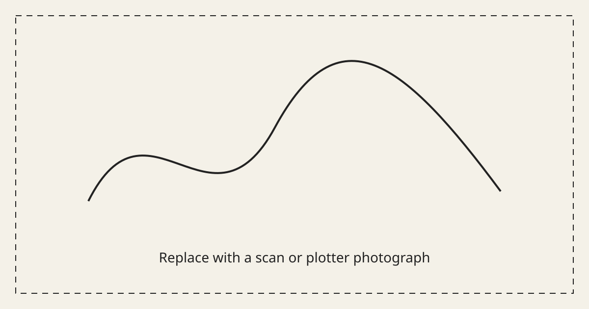
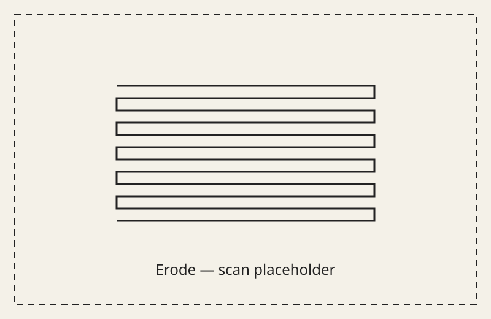
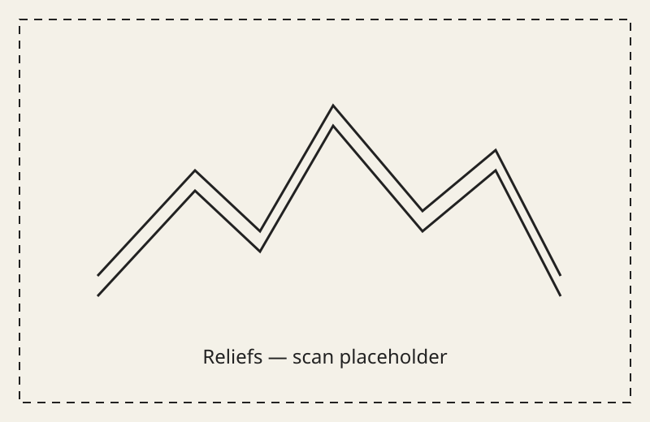

# Pen Plotter



A generative pen-plotting laboratory exploring how algorithms, geometry, ink,
and physical constraints interact. Python sketches and Blender line art are
turned into optimized SVG paths and machine-ready G-code for a LY DrawBot.

The repository is both a collection of visual experiments and the reproducible
toolchain used to take them from code to paper.

## Selected work

### Erode



A grid of squares, each filled from top to bottom by one continuous serpentine
line. The plotter reloads at its ink reservoir before every square, then the
physical depletion of ink becomes part of the image. See
[`sketches/erode`](sketches/erode).

### Reliefs



A deterministic series based on real terrain tiles. Slope, aspect, curvature,
and roughness drive a vocabulary of facets and plotted marks without producing
a literal topographic map. Read the full
[project notes](sketches/reliefs/README.md).

### Studies Monument

Deterministic isometric compositions built from a constrained grammar of
volumes and mark treatments. The planner and rendered geometry are covered by
the repository's automated tests. See
[`sketches/studies_monument`](sketches/studies_monument).

> The images above are temporary placeholders. Scans and photographs of the
> physical plots will replace them.

## Pipeline

```text
vsketch / Blender
        │
        ▼
       SVG
        │
        ▼
vpype: layout, merge, simplify, sort
        │
        ▼
      G-code
        │
        ▼
Universal Gcode Sender + LY DrawBot
        │
        ▼
   physical drawing
```

The pipeline deliberately keeps drawing generation separate from
machine-specific output. SVG files can be generated, inspected, and modified
without owning a plotter.

## Requirements

- Python 3.11 or later
- [`uv`](https://docs.astral.sh/uv/)
- Make (optional, but used by the documented shortcuts)
- a desktop environment for the interactive vsketch and vpype viewers
- Universal Gcode Sender only when controlling the plotter

The Python environment is locked in `uv.lock`.

## Quick start without a plotter

Clone the repository and install the locked dependencies:

```bash
git clone https://github.com/alex-boulanger/pen-plotter.git
cd pen-plotter
uv sync --locked
```

List the available commands and render a sketch with its default parameters:

```bash
make help
make render erode
```

The SVG is written to `sketches/erode/output/erode.svg`. Open the interactive
viewer when developing a sketch:

```bash
uv run vsk run sketches/erode
```

## Repository commands

Paths passed to the drawing commands are relative to `sketches/` and omit the
`.svg` extension.

```bash
make preview erode/output/erode
make optimize fade/output/fade_liked_1
make length fade/output/fade_liked_1
make gcode fade/output/fade_liked_1
make gcode-layers linetone/output/linetone_liked_1
make gcode-ink-reload erode/output/erode
make test
```

| Command            | Purpose                                           |
| ------------------ | ------------------------------------------------- |
| `render`           | render a vsketch project to SVG                   |
| `preview`          | display an SVG and its plotting statistics        |
| `optimize`         | merge, simplify, reloop, and sort paths           |
| `length`           | report pen-down and pen-up travel                 |
| `gcode`            | generate standard LY DrawBot G-code               |
| `gcode-layers`     | generate one LY DrawBot G-code file per SVG layer |
| `gcode-ink-reload` | reload ink at `(0, 0)` before every path          |
| `test`             | run the automated test suite                      |

`gcode-ink-reload` preserves path creation order. Do not run `optimize` first when
the order of ink reloads is part of the drawing.

## Blender workflow

Blender SVG exports can be previewed, fitted to A4, optimized, and converted to
G-code:

```bash
make blender-preview 0021
make blender-optimize 0021
make blender-gcode 0021
```

The Blender-specific pipeline proportionally fits the geometry to an A4
landscape page with a configurable margin. By default it reads from
`~/Documents/Blender/svg-output` and writes G-code to
`~/Documents/Blender/optimized-gcode`.

## Local configuration

The default paths can be overridden without editing the tracked Makefile:

```bash
cp config.mk.example config.mk
```

Edit `config.mk` for your workstation. The file is ignored by Git. Every value
can also be overridden for a single command:

```bash
make blender-gcode 0021 BLENDER_PAGE_MARGIN=15mm
```

Regular sketch G-code is written by default to
`~/Documents/Pen Plotter/optimized-gcode`.

## Hardware and safety

The profiles in [`calibration/ly_drawbot.toml`](calibration/ly_drawbot.toml)
are specific to the machine used for this project. They control page rotation,
axis flipping, feed rates, the pen servo, and the experimental ink-reload
sequence.

Read the [LY DrawBot setup and safety notes](docs/hardware.md) before sending
G-code to a machine. Always inspect a preview, verify the work origin, and test
at a low feed rate after changing calibration. Generated G-code must not be
assumed safe for another plotter.

## Project structure

```text
.
├── calibration/       # LY DrawBot profiles and calibration drawings
├── docs/              # hardware notes and gallery assets
├── shared/            # reusable geometry and image utilities
├── sketches/          # original generative-art projects
├── tests/             # deterministic geometry and rendering tests
├── config.mk.example  # local path configuration template
├── Makefile           # rendering, inspection, optimization, and G-code tasks
├── pyproject.toml      # Python project metadata and dependencies
└── uv.lock             # reproducible dependency lock
```

Create a new vsketch project with:

```bash
uv run vsk init sketches/my-sketch
```

## Tests

Run the complete suite with:

```bash
make test
```

The current tests verify deterministic composition planning, geometric
validity, page bounds, treatment constraints, and plotter pen-layer mapping.

## License

The repository is released under the [MIT License](LICENSE), including its
source code, documentation, and published visual assets unless a file
explicitly states otherwise.
